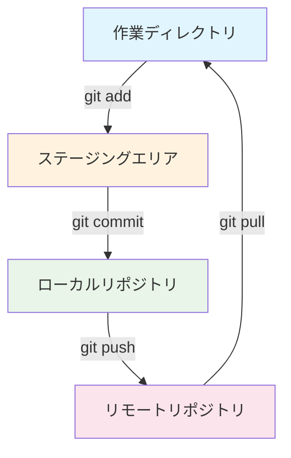
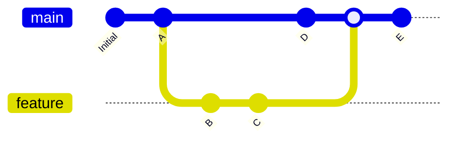
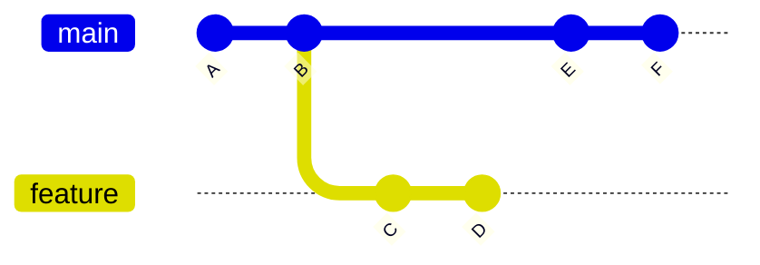
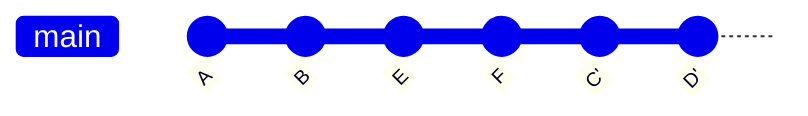
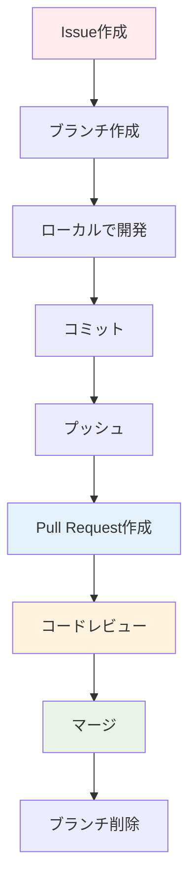

# Git・GitHub完全ガイド

## Gitとは

Gitは分散型バージョン管理システムです。プログラムのファイルの変更履歴を記録し、複数の開発者が同じプロジェクトで効率的に作業できるようにします。

### Gitの基本概念

#### リポジトリ（Repository）
プロジェクトのファイルと変更履歴を保存する場所です。

#### コミット（Commit）
ファイルの変更を記録するスナップショットです。各コミットには一意のIDが付与されます。

#### ブランチ（Branch）
開発の流れを分岐させる仕組みです。新機能の開発やバグ修正を独立して行えます。

## Gitの基本ワークフロー



### ステージの説明

1. **作業ディレクトリ**: 実際にファイルを編集する場所
2. **ステージングエリア**: コミット対象のファイルを準備する場所
3. **ローカルリポジトリ**: 自分のマシン上の変更履歴保存場所
4. **リモートリポジトリ**: サーバー上の共有リポジトリ

## ブランチの概念とマージ



### ブランチ戦略の例

- **main/master**: 本番環境用の安定版
- **develop**: 開発版の統合ブランチ
- **feature**: 新機能開発用ブランチ
- **hotfix**: 緊急バグ修正用ブランチ

## Gitの基本コマンド

### リポジトリの初期化と設定

```bash
# 新しいリポジトリを初期化
git init

# ユーザー情報の設定
git config --global user.name "Your Name"
git config --global user.email "your.email@example.com"

# 既存のリポジトリをクローン
git clone https://github.com/username/repository.git
```

### ファイルの追加とコミット

```bash
# ファイルをステージングエリアに追加
git add filename.txt
git add .  # すべてのファイルを追加

# ステージングエリアの状態確認
git status

# コミットの作成
git commit -m "コミットメッセージ"

# 追加とコミットを同時に実行（追跡済みファイルのみ）
git commit -am "メッセージ"
```

### ブランチ操作

```bash
# ブランチ一覧表示
git branch

# 新しいブランチを作成
git branch feature-login

# ブランチを切り替え
git checkout feature-login

# ブランチを作成して切り替え（一括）
git checkout -b feature-login

# ブランチを削除
git branch -d feature-login

# 強制削除
git branch -D feature-login
```

### マージとリベース

```bash
# ブランチをマージ
git checkout main
git merge feature-login

# コンフリクトが発生した場合の対処
git status  # コンフリクトファイルを確認
# ファイルを手動で編集してコンフリクトを解決
git add filename.txt
git commit -m "Merge conflict resolved"
```

## リベース（Rebase）の詳細解説

リベースは、ブランチの履歴を線形に整理する機能です。マージとは異なるアプローチでブランチを統合します。

### リベースの概念



上記の状態から：



### リベースの基本コマンド

```bash
# 現在のブランチをmainブランチにリベース
git checkout feature-branch
git rebase main

# インタラクティブリベース（コミットの編集）
git rebase -i HEAD~3  # 直近3つのコミットを編集

# リベース中にコンフリクトが発生した場合
git status  # コンフリクトファイルを確認
# ファイルを編集してコンフリクトを解決
git add filename.txt
git rebase --continue

# リベースを中止
git rebase --abort
```

### インタラクティブリベースのオプション

```bash
# インタラクティブリベースで使用できるコマンド
pick    # コミットをそのまま使用
reword  # コミットメッセージを変更
edit    # コミットを編集
squash  # 前のコミットと統合
fixup   # 前のコミットと統合（メッセージは破棄）
drop    # コミットを削除
```

### リベース使用例

```bash
# feature ブランチで作業
git checkout -b feature-user-auth
git commit -m "Add login form"
git commit -m "Add password validation"
git commit -m "Fix typo in login form"

# mainブランチに最新の変更を取り込んでからリベース
git checkout main
git pull origin main
git checkout feature-user-auth
git rebase main

# コミットを整理（fixup を使用）
git rebase -i HEAD~3
# エディタで以下のように編集：
# pick 1234567 Add login form
# pick 2345678 Add password validation
# fixup 3456789 Fix typo in login form
```

## リモートリポジトリ操作

```bash
# リモートリポジトリを追加
git remote add origin https://github.com/username/repository.git

# リモートリポジトリ一覧表示
git remote -v

# リモートブランチから最新情報を取得
git fetch origin

# リモートブランチの変更を取得してマージ
git pull origin main

# ローカルの変更をリモートにプッシュ
git push origin feature-branch

# 初回プッシュ時にアップストリームを設定
git push -u origin feature-branch
```

## GitHubとは

GitHubは、Gitリポジトリをオンラインで管理・共有できるサービスです。チーム開発に必要な機能が豊富に用意されています。

### GitHubの主要機能

#### Pull Request（プルリクエスト）
コードの変更を他の開発者にレビューしてもらうための仕組みです。

#### Issues（イシュー）
バグ報告や機能要求を管理するタスク管理システムです。

#### Actions（アクション）
CI/CD（継続的インテグレーション/デプロイ）を自動化する機能です。

## GitHubでの開発フロー



## GitHub操作のコマンド例

### Fork（フォーク）を使った開発

```bash
# 1. GitHubでリポジトリをFork

# 2. Forkしたリポジトリをクローン
git clone https://github.com/yourusername/original-repo.git
cd original-repo

# 3. 元のリポジトリを upstream として追加
git remote add upstream https://github.com/originaluser/original-repo.git

# 4. 新しいブランチで作業
git checkout -b feature-improvement

# 5. 変更をコミット
git add .
git commit -m "Add new feature"

# 6. 自分のフォークにプッシュ
git push origin feature-improvement

# 7. GitHubでPull Requestを作成

# 8. 元のリポジトリの更新を取得
git fetch upstream
git checkout main
git merge upstream/main
git push origin main
```

### GitHub CLI を使った操作

```bash
# GitHub CLI のインストール後

# Pull Request を作成
gh pr create --title "新機能の追加" --body "詳細な説明"

# Pull Request 一覧表示
gh pr list

# Pull Request をチェックアウト
gh pr checkout 123

# Issue を作成
gh issue create --title "バグ報告" --body "バグの詳細"

# リポジトリをクローン
gh repo clone username/repository
```

## よくあるトラブルと解決方法

### コンフリクトの解決

```bash
# マージ時のコンフリクト
git merge feature-branch
# コンフリクトが発生

# ファイルを確認
git status

# 手動でコンフリクトを解決後
git add conflicted-file.txt
git commit -m "Resolve merge conflict"
```

### 間違ったコミットの修正

```bash
# 直前のコミットメッセージを修正
git commit --amend -m "正しいメッセージ"

# 直前のコミットにファイルを追加
git add forgotten-file.txt
git commit --amend --no-edit

# コミットを取り消し（変更は保持）
git reset --soft HEAD~1

# コミットを完全に取り消し
git reset --hard HEAD~1
```

### プッシュの取り消し

```bash
# リモートの最新状態を確認
git log --oneline -10

# 特定のコミットまで戻す
git reset --hard commit-hash

# 強制プッシュ（注意：チーム開発では慎重に）
git push --force-with-lease origin branch-name
```

## ベストプラクティス

### コミットメッセージの書き方

```bash
# 良い例
git commit -m "Add user authentication feature"
git commit -m "Fix memory leak in image processing"
git commit -m "Update README with installation instructions"

# 避けるべき例
git commit -m "fix"
git commit -m "update"
git commit -m "WIP"
```

### ブランチ命名規則

```bash
# 機能追加
feature/user-login
feature/payment-integration

# バグ修正
bugfix/header-alignment
hotfix/security-vulnerability

# リファクタリング
refactor/database-queries
```

### .gitignore の活用

```bash
# .gitignore ファイルの例
node_modules/
*.log
.env
dist/
.DS_Store
*.swp
```

## まとめ

GitとGitHubは現代のソフトウェア開発に不可欠なツールです。基本的なワークフローを理解し、継続的に練習することで、効率的なチーム開発が可能になります。特にリベースは強力な機能ですが、慎重に使用することが重要です。

チーム開発では、プロジェクトのルールに従い、適切なブランチ戦略とコミットメッセージを心がけましょう。